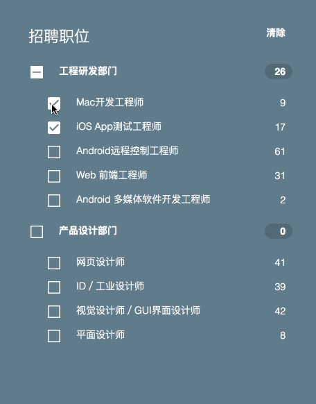

## 职位招聘的菜单UI交互组件
-----

#### 截屏（Screenshots）

标注图 | 展示图 |
:-------|:------|
 |  |

#### 功能点（Feature）
* 点击清空:清空所有选项(所有选项都变成unchecked)
* 点击部门左侧checkbox:toggle所有子目录下checkbox以及部门的checkbox
* 点击单个岗位checkbox:toggle点击的checkbox

#### 要求（Requirement）
* 像素级实现
* 使用 React.js 的 jsx（不需要工程化、不需要数据层依赖库 如flux，redux等）
* 注意state和props的用法
* 使用git，规范git commit的提交纪录
* 设计代码结构应尽量idiomatic
* 代码尽可能地简洁，规范，模块化，保持代码风格的一致性
* 可以使用ES6

#### 需要做（TODO）
* 完成项目的基础页面，react、react-dom、babel-standalone(或babel-core)
* 模拟定义mock接口的数据格式
* 定义前端的state对象数据结构
* 拆分组件
  * Menu组件（业务组件）
  * Tree组件（基础组件）
  * TreeNode组件（基础组件）
* 像素级UI样式
* 打印git commit日志

#### Example
[http://qiuge.me/react-exercise-menu/](http://qiuge.me/react-exercise-menu/)

#### 组件API（Component API）
-----
##### Menu props

name | description | type | default |
:-------|:------|:-----|:------|
title | 菜单名称 | String | '我是默认名字' |
data | 菜单的远程接口数据 | Array | [] |

##### Tree props

name | description | type | default |
:-------|:------|:-----|:------|
className | 添加到dom节点上的自定义样式 | String | '' |
checkedKeys | 所有被选择的treeNode | String[] | [] |
onCheck | 点击当前界点或checkbox的事件监听 | function(checkedKeys, e: {}) | - |

##### TreeNode props

name | description | type | default |
:-------|:------|:-----|:------|
className | 添加到dom节点上的自定义样式 | String | '' |
title | 节点的title | String/element | - |
key | 节点的唯一标示 | String | 0、1、2... |
isLeaf | 是否是叶子节点 | bool |  false |

#### Commit日志

[全部提交纪录地址：https://github.com/BETH-zhang/react-exercise-menu/commits/master](https://github.com/BETH-zhang/react-exercise-menu/commits/master)
##### 部分Commit 记录 1.0.0 (2018-05-20)

###### Features

* **count:** 完成计算子阶段人数到父节点上 ([ece5ab4](https://github.com/BETH-zhang/react-exercise-menu/commit/ece5ab4))
* **icon:** 更新图标颜色 ([9193598](https://github.com/BETH-zhang/react-exercise-menu/commit/9193598))
* **icon:** 添加三种状态的checkbox图标 ([f0e430f](https://github.com/BETH-zhang/react-exercise-menu/commit/f0e430f))
* **logo:** 添加自己的logo ([ffe1729](https://github.com/BETH-zhang/react-exercise-menu/commit/ffe1729))
* **prop-types:** 添加props的参数类型校验 ([970cce7](https://github.com/BETH-zhang/react-exercise-menu/commit/970cce7))
* **tree:** 利用getChildContext将Tree组件获取到的node节点通过context传给TreeNode组件 ([f270360](https://github.com/BETH-zhang/react-exercise-menu/commit/f270360))
* **tree:** 完成Tree和TreeNode的基础组件 ([c41a00c](https://github.com/BETH-zhang/react-exercise-menu/commit/c41a00c))
* **tree:** 实现Tree和TreeNode阶段的数据自定义数据渲染 ([70b1f7a](https://github.com/BETH-zhang/react-exercise-menu/commit/70b1f7a))
* **treenode:** 注册ContextTypes以保证Tree和TreeNode通过context进行信息的交互 ([ba90a34](https://github.com/BETH-zhang/react-exercise-menu/commit/ba90a34))

#### 扩展性
目前实现的简单版本TreeSelect组件，其扩展性非常多。（参考rc-tree组件的开发思想）

* 添加整个TreeNode节点的事件监听
* 添加TreeNode节点的拖拽事件
* 添加Tree的继承样式
* 添加Tree的新属性，使其可以添加菜单的折叠功能
* 可以根据不同的业务需求，二次封装改组件
* 可以扩展添加动画元素
* 只要希望存在的功能，都可以很好的自定义追加进去